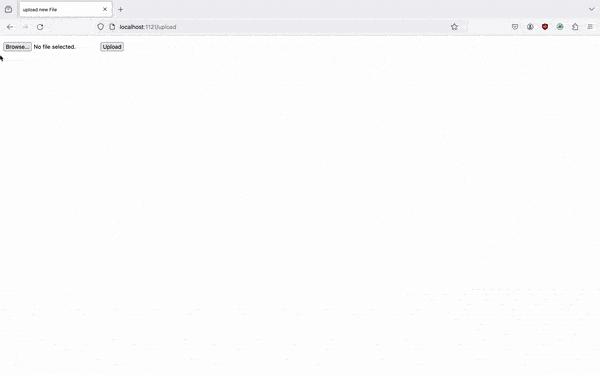

# Flask on Docker

## Overview
This repository provides Docker setup for deploying a Flask application with Postgres for both development and production environments. The repository has a configuration of Flask to run on Docker, integration with Postgres, and the addition of Nginx and Gunicorn for production deployment. The setup includes handling static and media files, making it a robust solution for containerized Flask applications.

Here is a short animated gif of uploading a file at http://localhost:1121/uploads:

## Build Instructions

### Development

Here is how to get Flask on Docker up and running from the root directory:

1. 
